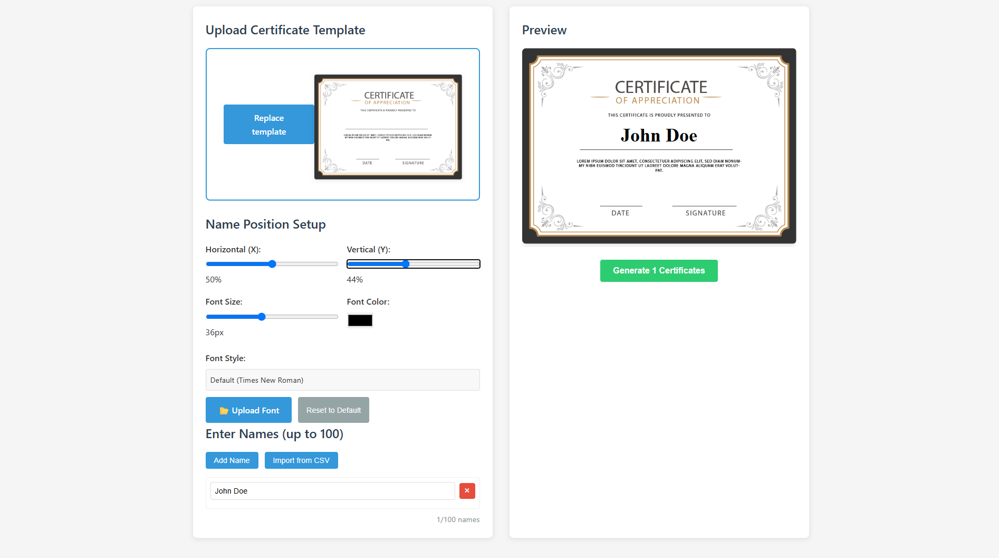

# Certificate Generator 🎓
A web-based tool for creating and printing multiple personalized certificates. Upload your template, add names, customize the text appearance, and generate printable certificates in bulk.



## 🏆 Features
- Upload custom certificate templates
- Adjust name positioning and styling
- Import names from CSV files
- Upload custom fonts for certificate text
- Add up to 100 names at once
- Preview certificate design in real-time
- Generate print-ready certificates
- Support for both portrait and landscape certificates
- Responsive design for desktop and mobile use

## 🛠️ Technologies Used
- HTML5
- CSS3
- JavaScript (ES6+)
- Vue.js (2.6)
- ES6 Modules
- Print API integration
- File API for handling uploads
- @font-face for custom fonts

## 📁 Project Structure
```
certificate-generator/
│
├── index.html
├── README.md
│
└── assets/
    ├── css/
    │   └── style.css
    ├── js/
    │   ├── main.js
    │   ├── certificateGenerator.js
    │   ├── fileHandlers.js
    │   ├── namesManager.js
    │   ├── fontHandler.js
    │   └── utils.js
    └── img/
        └── certificate-preview.png
```

## 🎨 Template Requirements
### Certificate Templates
- Format: JPG, PNG, or GIF
- Resolution: Recommended 300 DPI for print quality
- Orientation: Both landscape and portrait supported
- Design: Leave space for names to be added

### Font Files
- Supported formats: TTF, OTF, WOFF, WOFF2
- Size: Optimized web fonts recommended
- Licenses: Ensure fonts are licensed for your intended use

## 💻 Application Sections
- **Upload Area**: Upload certificate template
- **Position Setup**: Adjust name position, size, and color
- **Font Customization**: Upload and apply custom fonts
- **Names Input**: Add names manually or import from CSV
- **Preview**: Real-time preview of certificate design
- **Generation**: Generate all certificates for printing

## 🔧 Customization
### Adding Custom Fonts
1. Click the "Upload Font" button
2. Select a TTF, OTF, WOFF, or WOFF2 font file
3. The font will be applied to both the preview and generated certificates

### Importing Names from CSV
1. Prepare a CSV file with one name per line
2. Click "Import from CSV"
3. Select your CSV file
4. Names will be loaded into the application (maximum 100)

## 📋 Usage Instructions
1. **Upload a certificate template**: Click "Upload Template" and select your certificate image
2. **Position the name**: Use the sliders to adjust the horizontal and vertical position
3. **Style the name**: Set the font size and color
4. **Optional**: Upload a custom font
5. **Add names**: Enter names manually or import from CSV
6. **Preview**: Check how your certificate looks with the preview
7. **Generate**: Click "Generate Certificates" to create printable versions
8. **Print**: Your browser's print dialog will open automatically

## 🖨️ Printing Tips
- Set paper size to match your certificate template orientation
- Use high-quality paper or card stock for best results
- Disable headers and footers in your browser's print settings
- Enable background graphics in print settings if your template has a background

## 📝 License
This project is open source

## 👏 Acknowledgments
- Certificate design inspiration
- Vue.js team for the framework
- Font creators